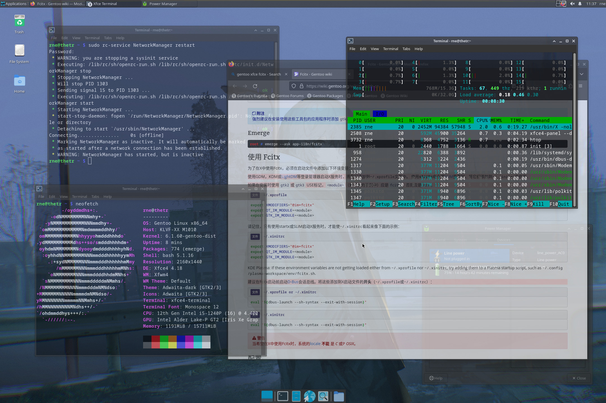
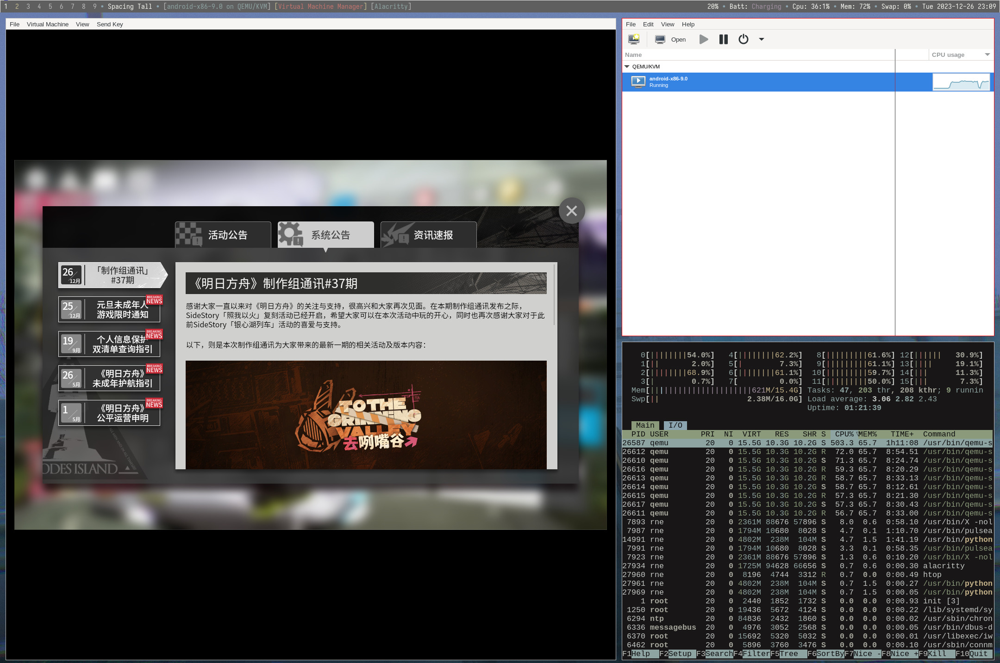
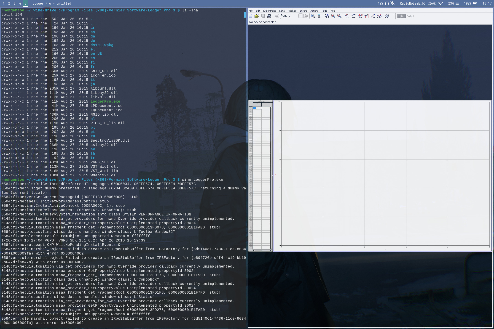
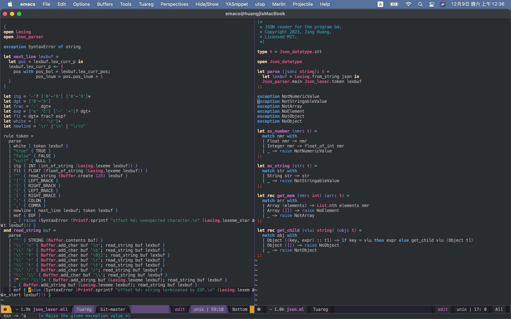

# Gentoo Linux實用指北
> 本文寫作於2024年1月，文中內容具有時效性，僅供參考。

## 關於本文
本文是對筆者4個月來折騰Gentoo Linux的一個總結，包括了安裝、優化以及配置的內容。需要注意：
1. 文中所述都是關於Amd64架構下Gentoo Linux的安裝和配置；
2. 本文不是[Gentoo Handbook](https://wiki.gentoo.org/wiki/Handbook:AMD64)，請確保在安裝之前／之後閱讀該官方手冊（建議食用英文版、中文版部分翻譯不全且過時）；
3. 本文針對的是筆記本電腦安裝桌面系統，內核配置、電源管理、桌面系統安裝等部分視個人情況而定；
4. 筆者電腦配置爲：CPU、GPU分別爲牙膏場12代的i5和iRISxe，使用英偉達顯卡的讀者可能需要另行檢索有關信息；使用UEFI。

## 目次
1. 基礎系統安裝
   - 準備安裝環境
   - 從stage1 到stage3（可選）
   - 選擇全局配置文件並安裝基礎系統
   - 配置內核（可選）
   - 雜項、工具及系統引導
2. 系統及軟件配置
   - 選取桌面系統
   - XOrg（XMonad）
   - Wayland（Sway）
3. 吐槽及展望
4. 參考資料和學習資料

## 基礎系統安裝

### 準備安裝環境

#### 引導
爲了完成Gentoo Linux的安裝、首先我們肯定要製作一個系統引導盤（LiveUSB）。Gentoo Linux的安裝跟大部分發行版不同之處就在於它並沒有提供一個有GUI或TUI界面作爲安裝向導的引導盤。相反，爲了最大程度地客製化，它只提供了一個內置各種安裝系統必備工具的不包含圖形界面的基礎系統；我們需要在以LiveUSB啓動後`chroot`至本機磁盤手動（一般情況下）完成安裝。這種繁瑣安裝方式給予了其最大的靈活性，真正意義上的選擇之多樣是Gentoo一個非常大的優勢。

我們可以從清華鏡像源處獲得LiveUSB的磁盤映像文件。官方提供了三種磁盤文件，這裏我們一般選擇`install-amd64-mininal`即可，文件地址在：
```
https://mirrors.tuna.tsinghua.edu.cn/gentoo/releases/amd64/autobuilds/current-install-amd64-minimal/.
```
隨後將該`iso`文件刻錄到U盤上（經過了Hybrid處理，可以直接刻錄到U盤上，不像FreeBSD）。這裏大家各顯神通就好。謹慎的讀者還可以校驗一下磁盤映像文件的完整性、校驗文件也在上面給出的地址下。之後將目標設備關機、插上製作好的引導盤後**先關閉SecureBoot後**啓動。然後你會看到OpenRC引導這Gentoo Linux啓動，至此我們就完成了第一步：引導。

#### 連接至網絡
進入LiveUSB的環境後，先運行`ifconfig`，看看除了`lo`之外是否有別的網卡設備被檢測到（比如`wlan`）。如果沒有那說明你的網卡不被支持，可以到互聯網上檢索並尋求幫助。有的話就可以運行`net-setup`（自帶的一個非常貼心的腳本），按照指引連接至網絡。如果使用`wlan`，大部分網絡都是WPA2/3，並建議讓`dhcp`決定ip地址。

隨後可以`ping`一下`gentoo.org`，看看自己是否成功聯網。然後視需求編輯`/etc/reslov.conf`（可用的編輯器有nano）。

#### 磁盤分區
接下來是很重要的一步：給目標設備的磁盤分區。（確定你的電腦使用不是BIOS啓動，如果是請參考Handbook）一般至少需要三個分區、分別是EFI分區（512MB~1024MB）、swap分區（主要是筆記本電腦休眠時使用，一般等於你的運行時內存大小即可）以及根分區。這裏也是，大家各顯神通就好；[這裏](https://wiki.gentoo.org/wiki/Handbook:AMD64/Installation/Disks)（Introduction to block devices至Partitioning the disk with MBR for BIOS / legacy boot）有Gentoo官方給出的方案，以及分區工具`fdisk`的手把手教學可供參考。下面給出我的方案、僅供參考：
```fdisk
Disk /dev/nvme0n1: 476.94 GiB, 512110190592 bytes, 1000215216 sectors
Disk model: [.*]
Units: sectors of 1 * 512 = 512 bytes
Sector size (logical/physical): 512 bytes / 512 bytes
I/O size (minimum/optimal): 512 bytes / 512 bytes
Disklabel type: gpt
Disk identifier: [.*]

Device            Start        End   Sectors   Size Type
/dev/nvme0n1p1     2048    2099199   2097152     1G Linux filesystem
/dev/nvme0n1p2  2099200    4196351   2097152     1G EFI System
/dev/nvme0n1p3  4196352   37750783  33554432    16G Linux swap
/dev/nvme0n1p4 37750784 1000214527 962463744 458.9G Linux filesystem
```
我額外分出了一個`/boot`分區，即`/dev/nvme0n1p1`。分完區後使用`fdisk -l /dev/[nvme0n1|sda|.*]`輸出你的分區方案，最好記錄一下，因爲之後編輯`/etc/fstab`時會用到。

隨後給這幾個分區配置不同的文件系統。EFI分區須使用FAT32、其餘參考[這裏](https://wiki.gentoo.org/wiki/Handbook:AMD64/Installation/Disks)（Creating file systems）。這是我的方案：
```bash
mkfs.ext4 /dev/nvme0n1p1
mkfs.vfat -F 32 /dev/nvme0n1p2
swapon /dev/nvme0n1p3
mkfs.btrfs /dev/nvme0n1p4
```
然後掛載根目錄：
```bash
mount /dev/nvme0n1p4 /mnt/gentoo
cd /mnt/gentoo
```
順便，Gentoo的LiveUSB是沒有預裝OpenZFS所需的工具的，這時候你就需要使用其它鏡像，即所謂的特殊情況；注意如果選擇了第三方的鏡像，可能會需要額外的安裝步驟，見Gentoo Handbook。

#### 選擇stage3檔案
關於stage3，他們是Gentoo系統安裝的種子。這時你需要作出選擇：
- 不喜`systemd`？選擇`OpenRC`；
- 對`glibc`感到不適？選擇`musl-llvm`（注意，沒有gcc和`glibc`一堆軟件是編譯不起來的）；
- 被迫還妄想症？選擇~~OpenBSD（劃掉）~~`hardened-selinux`；
- 喜歡禁慾？選擇`nomultilib`。

時辰已到，請選擇你的毒藥。stage3清單可在[這裏](https://mirrors.tuna.tsinghua.edu.cn/gentoo/releases/amd64/autobuilds/)查看。

作出選擇後可使用wget或cURL將其下載到`/mnt/gentoo`下：
```
wget https://mirrors.tuna.tsinghua.edu.cn/gentoo/releases/amd64/autobuilds/current-stage3-amd64-desktop-openrc/stage3-amd64-desktop-openrc-*.tar.xz
```
即可。謹慎的讀者這時又可以校驗一下磁盤映像文件的完整性。

然後使用：
```
tar xpvf stage3-*.tar.xz --xattrs-include='*.*' --numeric-owner
```
解壓。注意，一定要用這個命令解壓。參數解釋在Handbook中有，按需食用。

#### 配置`make.conf`並換源
編輯`make.conf`這一十分重要的配置文件（注意，是編輯`/mnt/gentoo/etc/portage/make.conf`文件而非`/etc/portage/make.conf`），決定我們的包管理器emerge編譯時的參數等等，是十分重要的可以優化的地方。

筆者將詳述一下重要的一定要配置的選項，更多敬請參考[官方指導](https://wiki.gentoo.org/wiki/Make.conf)。
- `COMMON_FLAGS`，作爲編譯時的一般參數，必備的參數有：`-march=native`（本設備硬件）、`-O2`（官方指導優化等級）、`-pipe`（管道代替中間文件）；
- `MAKE_OPTS`，一般用來設定make時的並行數，一般是中央處理器核心數的1/2；
- `CPU_FLAGS_X86`，使用`cpuid2cpuflags`工具獲得（須`chroot`後用包管理器取得），爲處理器優化可執行文件中使用的指令；
- `PORTAGE_TMPDIR`，包管理器後端存放中間文件的地方，內存大於16GB的建議設爲`/tmp`、將其置於內存中，加快編譯速度並減少對硬盤的大量讀寫、延長其使用壽命；
- `ACCEPT_LICENSE`，安裝軟件接受的許可證類型，官方提供了幾個集合，但像筆者這種沒什麼節操的當然是用`*`全部接受了；
- `ACCEPT_KEYWORDS`，選擇你安裝的軟件是使用穩定版本（amd64）還是激進版本（~amd64），後續是可以單獨選擇該軟件使用何種版本的。

筆者的配置也放出來供參考：
```conf
COMMON_FLAGS="-march=native -O2 -pipe -finline-functions -fomit-frame-pointer"
CFLAGS="${COMMON_FLAGS}"
CXXFLAGS="${COMMON_FLAGS}"
FCFLAGS="${COMMON_FLAGS}"
FFLAGS="${COMMON_FLAGS}"
LDFLAGS="${COMMON_FLAGS} -Wl,-O2 -Wl,--as-needed -Wl,--hash-style=gnu -Wl,--sort-common -Wl,--strip-all"
LC_MESSAGES=C.utf8
MAKEOPTS="-j8 -l8"
CPU_FLAGS_X86="aes avx avx2 f16c fma3 mmx mmxext pclmul popcnt rdrand sha sse sse2 sse3 sse4_1 sse4_2 ssse3"
PORTAGE_TMPDIR="/tmp"
AUTO_CLEAN="yes"
ACCEPT_LICENSE="*"
ACCEPT_KEYWORDS="amd64"
L10N="en-US en"
LINGUAS="en-US en"
GRUB_PLATFORMS="efi-64"
VIDEO_CARDS="intel"
ALSA_CARDS="hda-intel"
# INPUT_DEVICES="libinput synaptics"
LLVM_TARGETS="X86"
USE="pulseaudio vulkan wayland cjk iwd -kde -gnome"
GENTOO_MIRRORS="https://mirrors.tuna.tsinghua.edu.cn/gentoo"
```

隨後可以換個源（雖然來說默認的也沒有被牆、而且Gentoo安裝包由於是下載源碼然後編譯、與二進制發行版相比對網絡的要求更低、不換也可以）。
對於`make.conf`，可以使用官方提供的工具`mirrorselect`：
```bash
mirrorselect -i -o >> /mnt/gentoo/etc/portage/make.conf
```
以TUI的方式選擇鏡像，也可以直接在`make.conf`中加上一行：
```
GENTOO_MIRRORS="https://mirrors.tuna.tsinghua.edu.cn/gentoo"
```

還需換源的文件爲`/mnt/gentoo/etc/portage/repos.conf/gentoo.conf`，該文件指定了包管理器emerge使用的倉庫地址。該文件缺省設置在`/mnt/gentoo/etc/portage/config/repos.conf`，用：
```bash
cp /mnt/gentoo/usr/share/portage/config/repos.conf /mnt/gentoo/user/portage/repos.conf/gentoo
```
創建後按[指南](https://mirrors.tuna.tsinghua.edu.cn/help/gentoo-portage/)修改`sync-uri`即可。

#### `chroot`
終於可以chroot了。爲了在chroot環境中使用emerge從互聯網上獲取軟件包，將DNS信息複製一下：
```bash
cp --dereference /etc/resolv.conf /mnt/gentoo/etc/
```

這時建議同步一下電腦的時鐘，若誤差太多可能會影響後續emerge的同步校驗：
```bash
chronyd -q
```

然後使用官方提供的腳本，隨後載入設置並設置一個招搖的提示幅：
```bash
arch-chroot /mnt/gentoo
source /etc/profile
export PS1="(chroot) ${PS1}"
```

別忘了把一開始分出來的EFI分區掛載一下，對筆者來說是：
```bash
mount /dev/nvme0n1p1 /boot
mkdir /boot/efi
mount /dev/nvme0n1p2 /boot/efi
```
現在，你已經成功地進入到新環境了。

### BootStrap（可選）
這時，我們處在了一個由先前下載並解壓的stage3構建的一個基礎系統中。它包括了標準庫、編譯器等Linux系統的必要組成部分，是由Gentoo Release Engineering Team（好高級的名字、發行工程誒）幫我們預先編譯好的。根據[FAQ](https://wiki.gentoo.org/wiki/FAQ)，從頭至尾構建這些所得的收益並不會很大，而所花的時間非常長，特別是如果你的gcc像筆者一樣開啓了`lto`、`pgo`等特性，對於一般電腦至少需要4小時（甚至gcc就要編譯至少3次［至少是因爲，如果你的gcc開了`pgo`、那麼就需要重複編譯5次］）。故讀者需要明智地選擇是否進行這一步。若不需要則**直接**進入下一部分『選擇全局配置文件並安裝基礎系統』即可。選擇該部分的讀者在下一部分可忽略重複步驟（筆者將會指明）。

首先我們先同步一下本機的包管理器數據庫（其實就是一個在`/var/db/repos/`下的一堆文件）：
```bash
emerge --sync
```
隨後選取你要使用的基礎系統配置文件，他們是Gentoo系統構建的磚塊。（根據Handbook，）它不僅幫你決定了`USE`、`CFLAGS`等的值，更限定了系統上軟件包的版本。根據你在選stage3時和實際需求選擇即可。使用：
```bash
emerge profile list
```
列出可選的配置後運行：
```bash
eselect profile set [num]
```
應用。[這裏](https://wiki.gentoo.org/wiki/Handbook:AMD64/Installation/Base)的Choosing the right profile一節有更多相關信息。

#### 從stage1 到stage2
官方提供了一個腳本，我們只需要運行它即可：
```bash
cd /var/db/repos/gentoo/scripts
./bootstrap.sh
```

#### 從stage2到stage3
理論上按照Gentoo官方的說法，這一步只需要`emerge -e @system`構建系統工具鏈即可。然而由於那個bootstrap.sh腳本估計是沒怎麼維護了，出來的gcc編譯器缺少構建系統所需的一個特性、需要手動使用`USE=openmp`開啓。這一步你也可以配置更多gcc的特性，詳見[這裏](https://wiki.gentoo.org/wiki/GCC)。爲了開啓這些特性，我們需要在`/etc/portage/package.use/`目錄下創建一個文件（文件名無所謂，但爲了可維護性有兩種廣泛使用的方案：創建一個文件存放所有軟件的`USE`配置和爲每一個需要配置的軟件創建一個新文件），並寫入：
```
sys-devel/gcc openmp
```
即可。（如果軟件名沒有重疊，你也可以省去類名直接寫gcc。）

隨後使用新的配置重新編譯gcc：
```bash
emerge --oneshot sys-devel/gcc
```
漫長的等待過後，我們再運行；
```bash
emerge -e @system
```
即可重構系統的底層依賴。至此我們就完成了從stage1到stage3的構建，可喜可賀、可喜可賀。

由於我們已經選取過了系統的全局配置（那個profile），可以越過下一章開頭的選取部分。

### 安裝系統

#### 同步包管理器數據庫並選取全局配置文件

首先同步包管理器所使用的軟件包數據庫（其實這一步就是下載放在不同文件夾裏的ebuild文件）：
```
emerge --sync
```

現在需要選取系統配置文件，參考官方[學習資料](https://wiki.gentoo.org/wiki/Handbook:AMD64/Installation/Base)中Choosing the right profile一節，列出並選擇：
```bash
emerge profile list
emerge profile set [num]
```

#### 配置`make.conf`文件
這時我們接着配置這個文件。先前由於沒有`cpuid2cpuflags`這個工具，無法配置該環境變量，現在我們只需：
```bash
emerge --oneshot --ask app-portage/cpuid2cpuflags # 安裝
cpuid2cpuflags # 輸出
emerge -c app-portage/cpuid2cpuflags # 過河拆橋
```
即可。

然後配置顯卡（一些軟件如mesa可能會用到該變量）：
```bash
echo "VIDEO_CARDS=\"intel\"" >> /etc/portage/make.conf
```
怎麼指導我的設備該填寫怎樣的值，需要怎樣的配置呢？[AMD](https://wiki.gentoo.org/wiki/AMDGPU)、[Intel](https://wiki.gentoo.org/wiki/Intel)、Nvidia[開源](https://wiki.gentoo.org/wiki/Nouveau)和[閉源](https://wiki.gentoo.org/wiki/NVIDIA)。（還是老黃有牌面。）

#### 重建系統（可選）
這一步是可選的，且只在你做出了：
1. 修改全局的`USE`旗標後；
2. 出爾反爾、做出了跟你在選取stage3文件時截然相反地選擇（比如從OpenRC投向了Systemd）；
3. 不趕時間、生活比較從容
時纔會帶來好處。如果你趕時間，即使你做出了1、2中的行爲也可以閒適自得地跳過這步，因爲可能會需要一段等待的時間。

如果堅定信念決定重建，執行：
```bash
emerge -avuDN @world
```
然後按下回車就好。等emerge幹好了工作，再用：
```bash
emerge --ask --depclean
```
移除不被依賴的軟件包（這步十分殘忍、請確認後再確認）。

#### 本地化
從這一節開始，就需要區分OpenRC和Systemd各自的步驟。筆者用的是OpenRC，使用Systemd的用家可以從[這裏](https://wiki.gentoo.org/wiki/Handbook:AMD64/Installation/Base)的Optional: Using systemd as the system and service manager處開始按步驟使用不同的命令完成安裝（兩種方案在安裝時只會有細節上的區別）。

首先我們設定時區，使用以下命令查看可用時區：
```bash
ls -l /usr/share/zoneinfo
```
所謂時區其實就是這個目錄下的目錄中細分的文件，非常符合所謂的Unix哲學、這很好。然後應用：
```bash
echo "Asia/Shanghai" > /etc/timezone
emerge --config sys-libs/timezone-data
```

接着我們設置本地語言環境（locale），修改（取消註釋）`/etc/locale.gen`文件即可。編輯修改該文件後、應用：
```bash
nano /etc/locale.gen # 修改文件
locale-gen # 生成
eselect locale list # 列出可選的本地語言環境
eselect locale set [num] # 選取你需要的環境
```

最後我們使上述配置生效：
```bash
env-update && source /etc/profile && export PS1="(chroot) ${PS1}"
```

### 配置系統內核（手動配置可選）
終於到了配置內核的時候。有三種方案供各位選擇：
1. 用發行版內核、發行版內核不會針對你的設備作任何修改、但主打的一個省心方便且快捷，官方甚至貼心地提供了編譯好的內核、將會在下文提到；
2. 用混合驅動模式、使用官方提供的genkernel工具、能夠自己配置內核、但對一些後續的擴展來說不是很方便（比如你想打一個cjkTTY補丁或者想用plymouth配置Boot Splash）、好處大概在於自動化；
3. 手動編譯、即下文主要講的方案。

#### 必要驅動安裝
這一步是無論你使用什麼內核安裝方式都需要完成的。我使用emerge提供的集合方式安裝（便於管理）。先創建目錄：
```bash
mkdir /etc/portage/sets
```
這個目錄就是我們存放所有集合文件的地方。隨後在該目錄下創建一個文件、文件名隨意、但最好跟該集合包含的包有關。比如爲了存放驅動，我們創建一個名爲`firmware`的文件並在其中寫入要安裝的包：
```bash
touch /etc/portage/sets/firmware
echo "sys-kernel/linux-firmware" >> /etc/portage/sets/firmware # 需安裝的linux-firmware包
echo "sys-firmware/sof-firmware" >> /etc/portage/sets/firmware # 需安裝的sof-firmware包（聲卡驅動）
```
隨後使用：
```bash
emerge --ask @firmware
```
即可安裝linux-firmware和sof-firmware兩個包。如果不使用集合的方式，則將`@firmware`替換爲兩個包的名字即可（不需要`@`）。

#### 發行版內核安裝
以下是使用GNU GRUB作爲系統引導時的安裝步驟，如果有特殊需求參考[這裏](https://wiki.gentoo.org/wiki/Handbook:AMD64/Installation/Kernel)的Distribution kernels一節即可。

首先我們要安裝installkernel這個包。如果你有在內核升級後自動幫你運行`grub-mkconfig`指令的話，需要打開該包的`grub`特性：
```bash
touch /etc/portage/package.use/installkernel
echo "sys-kernel/installkernel grub" >> /etc/portage/package.use/installkernel
```
隨後創建kernel集合：
```bash
touch /etc/portage/sets/kernel
echo "sys-kernel/installkernel" >> /etc/portage/sets/kernel # 需安裝的installkernel包
echo "sys-kernel/gentoo-kernel" >> /etc/portage/sets/kernel # 需安裝的gentoo-kernel包（如果不想本機編譯內核、安裝gentoo-kernel-bin即可）
```

然後就安裝。發行版內核很大，你需要等一等。
```bash
emerge --ask @kernel
```

#### 手動編譯內核
同樣創建kernel集合先安裝需要的包：
```bash
touch /etc/portage/sets/kernel
echo "sys-kernel/gentoo-sources" >> /etc/portage/sets/kernel # 內核源文件
echo "sys-kernel/dracut" >> /etc/portage/sets/kernel # initramfs
```
Gentoo提供了許多內核，比如沒有對Gentoo進行適配的vanilla、性能優化的zen、以及其他的分支，根據喜好／需求選擇即可。至於用來生成initramfs的dracut，也可以用官方的genkernel替代；但需要注意的是genkernel至今爲提供對plymouth的支持。

使用`emerge -a @kernel`安裝後，即可開始配置：
```bash
cd /usr/src/linux-6.1.67-gentoo/ # 最後的文件夾名會根據你所安裝內核及版本有所區別
make menuconfig # 基於curces的菜單式配置界面
```
關於內核配置，我不推薦使用`make localyesconfig`的方式，因爲這種方式只會將正在使用的驅動改成`yes`（嵌入），建議只做爲參考。在配置顯卡／聲卡／網卡的驅動時，不建議嵌入、而作爲模塊載入。否則可能導致找不到網卡、無聲音、mpv報錯等問題。關於內核各個選項的意義、推薦閱讀金步國的[Linux-4.4-x86_64内核配置选项简介](https://www.jinbuguo.com/kernel/longterm-linux-kernel-options.html)，然後對照着配置就好。遇到不明白的就善用搜索。同時，在[官方文檔](https://wiki.gentoo.org/wiki/Handbook:AMD64/Installation/Kernel)的Alternative: Manual configuration一章中有關於內核必須的配置提示及警告。Gentoo Wiki上也會寫出一些對內核有特殊要求的包對應的配置要求，需要特別注意。比如這是iwd（`wpa_supplicant`的現代替代）所需的內核配置，寫的十分詳細：
```kernel
Security options  --->
    [*] Enable access key retention support
    [*] Diffie-Hellman operations on retained keys
Networking support  --->
    [*] Wireless  --->
        <M> cfg80211 - wireless configuration API
Cryptographic API  --->
    *** Public-key cryptography ***
    [*] RSA algorithm
    [*] Diffie-Hellman algorithm
    *** Block modes ***
    [*] ECB support
    *** Hash modes ***
    [*] HMAC support
    *** Digest ***
    [*] MD4 digest algorithm
    [*] MD5 digest algorithm
    [*] SHA1 digest algorithm
    [*] SHA1 digest algorithm (SSSE3/AVX/AVX2/SHA-NI)   // AMD64 and SSSE3
    [*] SHA224 and SHA256 digest algorithm
    [*] SHA256 digest algorithm (SSSE3/AVX/AVX2/SHA-NI) // AMD64 and SSSE3
    [*] SHA384 and SHA512 digest algorithms
    [*] SHA512 digest algorithm (SSSE3/AVX/AVX2)        // AMD64 and SSSE3
    *** Ciphers **
    [*] AES cipher algorithms
    [*] AES cipher algorithms (x86_64)                  // AMD64
    [*] AES cipher algorithms (AES-NI)                  // X86_AES
    [*] ARC4 cipher algorithm
    [*] DES and Triple DES EDE cipher algorithms
    [*] Triple DES EDE cipher algorithm (x86-64)        // AMD64
    *** Random Number Generation ***
    [*] User-space interface for hash algorithms
    [*] User-space interface for symmetric key cipher algorithms
    [*] Asymmetric (public-key cryptographic) key type  --->
        [*] Asymmetric public-key crypto algorithm subtype
        [*] X.509 certificate parser
        [*] PKCS#7 message parser
        <M> PKCS#8 private key parser                   // linux kernel 4.20 or higher
```
所以在手動配置內核所能帶來的精簡之外，安裝軟件時便可能需要額外的折騰，比如iptables、這個東西需要的內核配置特別多，但想要在QEMU里玩遊戲還必須配置。如果你的筆記本電腦需要能用的電源管理，別忘了看[這篇電源管理](https://wiki.gentoo.org/wiki/Power_management/Guide)（建議別現麻煩，把`thermald`配一下）和[這篇關於休眠](https://wiki.gentoo.org/wiki/Suspend_and_hibernate)的文章。同時也注意一下時鐘滴答、頻率這些對性能影響較大的選項。

在大顯神通之後，想必各位也完成了配置。推出menuconfig界面並保存之後，你的配置會被寫入當前目錄下的`.config`文件中。接下來使用：
```bash
make -j11 # 根據自己硬件調整
make modules_install
make install
dracut --force --hostonly # 生成initramfs，如果你在內核中配置了支持的壓縮方式，別忘了指定，如 --xz
```
最後別忘記：
```bash
eselect kernel list # 查看可用內核
eselect kernel set [num] # 選取
```

### 雜項、工具、及系統引導

#### fstab文件
爲了讓系統知道該掛載硬盤的哪個分區、每個分區上裝的是什麼東西、用的是什麼文件系統、掛載時需要什麼參數、以及掛載的行爲、優先級等，需要編輯`/etc/fstab`文件。具體的語法請看[這裏](https://wiki.gentoo.org/wiki/Handbook:AMD64/Installation/System)的About fstab一節。下面是我的配置，供參考：
```fstab
/dev/nvme0n1p1    /boot        ext4    defaults        1    2
/dev/nvme0n1p2    /boot/efi    vfat    defaults        0    2
/dev/nvme0n1p3    none         swap    sw              0    0
/dev/nvme0n1p4    /            btrfs   compress=zstd:2 0    1
```
這個文件比較重要，千萬別手抖。

#### 網絡相關
我們先給自己的機器設一個主機名（注意：如果你在內核里指定了就不要衝突）：
```bash
echo gentoo > /etc/hostname
```

隨後安裝一個網絡管理器。一般常用的是NetworkManager（如果你要用Gnome必裝、KDE考慮、xfce謹慎、對於WM來說就太重了），還有就是Gentoo自己的netifrc、ConnMan這些。我用的是iwd，單獨使用需開啓`standalone`特性：
```bash
touch /etc/portage/package.use/iwd
echo "net-wireless/iwd client monitor standalone" >> /etc/portage/package.use/iwd
emerge -a iwd # 我使用集合來管理，但爲了命令精簡往後一次只需安裝單個包時會直接安裝
```
隨後編輯`/etc/iwd/main.conf`文件：
```conf
# /etc/iwd/main.conf

[General]
EnableNetworkConfiguration=true
[Network]
NameResolvingService=resolvconf
```
最後使其開機自啓：
```bash
rc-update add iwd default
```

也推薦Gentoo自己的netifrc、但是就是說我嫌`net.wlan0`太醜了（其他都是什麼`local`、`consolefont`、`tlp`，風格完全不統一啊）。

然後各位視需求編輯一下`/etc/hosts`文件即可。
```bash
nano /etc/hosts # 預裝的編輯器是nano、覺得苦手可以用emerge裝來用
```

#### 系統信息
首先設置root賬戶的密碼（弱密碼會提醒）：
```bash
passwd
```

隨後配置一下OpenRC，比如看看自己要不要開一個parallel什麼的（我覺得意義不是很大）：
```bash
nano /etc/rc.conf
```

由於大部分在大陸買的電腦鍵盤盤佈局是標準的US佈局，就不需要管`/etc/conf.d/keymap`。但需要注意的是硬件時鐘，用`date`命令看看是不是UTC，如果不是就需要在`/etc/conf.d/hwclock`里設置`clock="local"`。

#### 系統工具
先安裝系統日誌管理，可選的有sysklogd、syslogng和metalog。
```bash
emerge -a app-admin/syslog-ng
```

隨後Handbook上建議安裝一個Cron Daemon（定時規劃任務）、這個我覺得沒必要手動裝，你在安裝一些需要用到該功能的包時會自動把它作爲依賴裝上的。可選的有cronie、dcron、fcron和bcron。

如果你打算就用默認的bash、裝一個自動補全會極大提升你的使用體驗：
```bash
emerge -a app-shells/bash-completion
```

如果你希望（在啓動時）同步硬件時鐘：
```bash
emerge -a net-misc/ntp # 常用的還有chrony等
rc-update add ntp-client default
```

最後針對你選取的文件系統，需要安裝其常用工具：
```bash
touch /etc/portage/sets/fs # fs集合
echo "sys-fs/e2fsprogs" >> /etc/portage/sets/fs # ext4用
echo "sys-fs/dosfstools" >> /etc/portage/sets/fs # vFAT用
echo "sys-fs/btrfs-progs" >> /etc/portage/sets/fs # btrfs用
emerge --ask @fs # 安裝
```

除非你是root敢死隊、不然還是裝一個doas／sudo比較好。我用doas，因爲我是個人筆記本電腦，完全用不到sudo的那麼多功能：
```bash
emerge -a app-admin/doas
```
然後根據[Gentoo Wiki](https://wiki.gentoo.org/wiki/Doas)，創建一個安全的配置文件後配置doas：
```bash
touch /etc/doas.conf
chown -c root:root /etc/doas.conf
chmod -c 0400 /etc/doas.conf
```
然後將對doas的配置寫在剛創建的`/etc/doas.conf`文件中即可：
```bash
permit nopass :wheel # 危險，除非你知道你在做什麼，否則不要照抄
```
因爲除了我之外不會有人碰我電腦，我也不是Linux運維什麼的，所以的設置的是只要用戶在wheel組里無需密碼就可以用doas獲得root權限。

最後如果你希望你的開機界面好看一點、可以安裝plymouth：
```bash
touch /etc/portage/sets/bootsplash # bootsplash集合
echo "sys-boot/plymouth" >> /etc/portage/sets/bootsplash # 本體
echo "sys-boot/plymouth-openrc-plugin" >> /etc/portage/sets/bootsplash # 交合用
```
這時如果你選了`amd64`的穩定版，你可能會發現它被mask了。使用：
```bash
touch /etc/portage/package.accept_keywords/bootsplash
emerge -a @bootsplash --autounmask-write --autounmask
mv /etc/portage/package.accept_keywords/._*bootsplash /etc/portage/package.accept_keywords/bootsplash # 如果你想把所有需要unmask的放在一個文件里，那麼也可以把這一步替換爲dispatch-conf
```
常用的unmask的工具是`dispatch-conf`，但有時候會在決定該將更新的規則寫入哪個文件時犯錯誤，所以上面提供了另一種思路。順便，它默認的diff是沒有顏色區分的，這不好；於是我們修改`/etc/dispatch-conf.conf`文件中的一行爲：
```
diff="diff --color=always -Nu '%s' '%s'"
```
就好了。你還可以選擇其它的diff工具，但完全沒必要（這些自動生成的規則能有多複雜）。

回到plymouth，執行一下命令來選擇你需要使用的啓動畫面：
```bash
plymouth-set-default-theme -l
```
然後選擇你要使用的後重新生成initramfs：
```bash
plymouth-set-default-theme details
dracut --force --hostonly
```
像我這樣選了純文本界面的，可能會有配置終端字體的需求。在`/etc/conf.d/consolefont`文件中修改`consolefont`爲你喜歡的字體（注意看註釋）：
```
consolefont="sun12x22"
```
然後讓它開機自啓：
```bash
rc-update add consolefont default
```
至於我爲什麼要用plymouth專門模擬OpenRC啓動時的默認行爲，因爲它原生的界面可能會對不齊（因爲它認爲屏幕的大小變化了）。

#### 系統引導
最後一步就是安裝系統引導了。這裏不說使用efibootmgr、也不講Secure Boot，只說最標準的GRUB2引導（我覺得我已經寫不動了、而且情況太多了）。首先UEFI用戶在`/etc/portage/make.conf`文件中加上：
```
# /etc/portage/make.conf

GRUB_PLATFORMS="efi-64"
```
再安裝GRUB（**注意**一定別漏了這一步！）：
```bash
emerge -a sys-boot/grub
```
隨後根據你先前給磁盤分區時的方案，將引導安裝在該啓動目錄下。對於我的方案是：
```bash
grub-install --efi-directory=/boot/efi
```
最後根據需求編輯`/etc/default/grub.cfg`，比如你配置了plymouth就要修改其中的：
```bash
# /etc/default/grub.cfg

GRUB_CMDLINE_LINUX_DEFAULT='quiet splash'
GRUB_GFXMODE=2160x1440x32 # 改爲你自己顯示屏的參數
GRUB_GFXPAYLOAD_LINUX=keep
```
最後生成配置即可：
```bash
grub-mkconfig -o /boot/grub/grub.cfg
```

### 打掃並重啓進入嶄新的系統～
我們需要收個尾，然後重啓離開livecd環境進入實打實的Gentoo Linux後準備配置桌面環境。

首先退出chroot：
```bash
exit
```
隨後解除掛載後即可關機：
```bash
cd
umount -l /mnt/gentoo/dev{/shm,/pts,}
umount -R /mnt/gentoo
shutdown -h now
```

開機後如果沒出意外就會進入系統。使用root賬戶登錄就準備好安裝桌面環境了。如果啓動不能也不要驚慌，再用livecd啓動後chroot進去看看是哪裏出問題了然後哪裏不對改哪裏就好。

## 桌面環境的安裝

### 選擇
人們的xp豐富多樣，Linux的桌面環境也是牛鬼蛇神。古有X Window System、今有Wayland作爲協議。兩者之上又有數不清的被我們成爲桌面環境的東西。桌面環境的構成如下：
- 窗口管理器，有平鋪式、疊加式和他們的雜交之分，它們控制窗口；
- 狀態欄、程序坞、合成器等，它們讓我們的桌面環境變得很好。

目前主流的桌面環境有Gnome、KDE和Xfce等，還有窗口管理器如dwm等。Gnome這些是由窗口管理器和一些其他的程式組成的環境，而那些窗口管理器則需要用戶自己挑選那些用來提供狀態欄等功能的程式。

除此之外，許多人還會選擇一個叫顯示管理器的東西，它可以爲用戶提供圖形化的登錄界面以及符合直覺的切換桌面環境的東西。他們有sddm、gdm、lightdm、slim等。關於它們有一個小故事（來自[FreeBSD中文社區](https://book.bsdcn.org/di-4-zhang-zhuo-mian-an-zhuang/di-4.0-jie-gai-shu)）：
> sddm、gdm、lightdm、slim在系統里~~開銀趴~~亂戰：
> sddm：我背後是KDE
> gdm：我背後是Gnome
> lightdm：我背後可以是任何一個
> slim：怎麼辦？好慌，潛水太久，管理員要踢我了
> 系統：合着你們在我地盤上養蠱呢

總之，要不用他們也是完全可行的。

至於選取哪個桌面系統，我第一、二次安裝Gentoo時安裝的都是KDE，但我覺得它有些複雜了：有非常靈活的佈局，甚至可以手動拖動配置；然而當我想要程序坞根據正在運行的程序自動調整寬度時，網上推薦的方案都是安裝一個圖標極丑的latte dock。而且它的整體風格我不太喜歡，知乎上有人評價說像Windows，雖然我沒怎麼用過Windows（一開始想裝Gentoo就是因爲第一次買Windows電腦然後用不慣Windows）所以不知道，但就是感覺不太對。當然KDE的性能沒得說，資源佔用也非常少。接着我試了試Gnome4，雖然第一眼看上去很好看，交互動作很豐富也很流暢，但是資源佔用稍微高了點，同時想要稍微改一改佈局什麼的話非常反人類，直接就放棄了。所以當時第三次我是安裝了Xfce。


用着感覺挺舒服的。但之後聽說了XMonad這個用Haskell寫的平鋪式窗口管理器，非常好奇於是又重裝了系統。發現也很好用。Haskell環境我原來就有，雖然我一般都寫OCaml的，Gentoo有slot、不需要擔心衝突。至於性能，還是可以的。至於生態，我覺得還是很豐富的，XMonad-contrib里有各種各樣的包滿足各種各樣的需求。配置也很方便，抄Wiki的時候順便改一改就好了。


然後第三次的時候裝wine-proton的時候手殘，處理循環依賴的時候忘了`--oneshot`，然後dispatch-conf完`emerge -avuDN @world`報依賴衝突，然後我又是一通亂搞，依賴衝突越來越多。於是又重裝。還是XMonad，配置什麼都有了，安裝了一個非常乾淨的系統。但越用X Window System越覺得不乾淨。於是又重裝，這次是swayWM，用Vulkan後端。第五次重裝後我終於覺得能一直用下去了。基於Wayland的窗口管理器在字體渲染上整體觀感比XOrg好了太多，在XMonad中我還需要額外設置modesetting驅動的tearfree，而觸控屏、觸控板的手勢等是之前不敢想象的。




用swayWM，我寫完了物理的Internal Assignment、完成了TOK的大作業、寫了一個在OCaml里處理JSON用的[庫](https://github.com/RadioNoiseE/JSON-ML)、~~還看完了『平穩世代的韋馱天』和『異世界舅舅』~~，感覺十分滿意。所以下面將分別講使用基於X Window System的XMonad和Wayland的swayWM。

如果你希望安裝其它窗口管理器，在搜索引擎搜索「Gentoo」後加上該窗口管理器的名字然後根據Wiki安裝即可。如果你希望使用桌面環境，重新選擇系統配置文件：
```bash
eselect profile list
eselect profile set [num] # 選取上個命令列出的profile中帶有桌面環境名字的，如Gnome OpenRC等
```
隨後更新：
```bash
emerge -avuDN @world
```
隨後遵從Gentoo Wiki的安裝指南即可。

### XOrg與XMonad

#### 安裝必要軟件
創建wm集合：
```bash
touch /etc/portage/sets/wm
echo "x11-base/xorg-server" >> /etc/portage/sets/wm # XOrg服務器，這時可以不裝，在安裝XMonad時被作爲依賴安裝
echo "x11-wm/xmonad" >> /etc/portage/sets/wm # 窗口管理器
echo "x11-wm/xmonad-contrib" >> /etc/portage/sets/wm # 對窗口管理器的（社區）擴展
echo "x11-misc/xmobar" >> /etc/portage/sets/wm # 跟Xmonad配套的同樣使用Haskell作成的狀態欄，可選的還有dzen
echo "x11-misc/picom" >> /etc/portage/sets/wm # 合成器，如果你不需要窗口透明等特效可以不裝
echo "media-gfx/feh" >> /etc/portage/sets/wm # 用來設定背景圖片的，大概率是必裝的
echo "x11-misc/slock" >> /etc/portage/sets/wm # sucklss出品的很精緻的鎖屏工具
echo "media-gfx/scrot" >> /etc/portage/sets/wm # X11下的截圖工具
echo "x11-misc/rofi" >> /etc/portage/sets/wm # 應用程式啓動器，不用dmenu是因爲它會遮住狀態欄，這不好
echo "x11-terms/alacritty" >> /etc/portage/sets/wm # 被譽爲最快的終端模擬器，美中不足在於是用Rust寫的（編譯Rust對Gentoo用戶不友好）
```
隨後一鍵安裝：
```bash
emerge --ask @wm
```
然後就沒有然後了，可以開始配置了。

#### 配置
因爲XMonad的特殊性，我們需要先創建一個普通用戶（使用XMonad窗口管理器的）：
```bash
useradd -m -G users,wheel,audio,cdrom,cron,portage,usb,video -s /bin/bash larry # 創建Larry奶牛用戶
passwd larry # 設置用戶密碼
```
隨後使用`exit`退出root賬戶後用新創建的用戶賬戶登錄後就可以正式開始配置了

首先我們要寫`.xinitrc`腳本，當我們使用startx的時候調用的就是這個腳本來啓動XMonad的：
```bash
touch ~/.xinitrc
echo "exec dbus-launch --sh-syntax --exit-with-session xmonad" >> ~/.xinitrc
```
即可。

如果你需要在登錄到該用戶後自動開啓XMonad，則在`.bash_profile`中添加：
```bash
if shopt -q login_shell; then
    [[ -f ~/.bashrc ]] && source ~/.bashrc
    [[ -t 0 && $(tty) == /dev/tty1 && ! $DISPLAY ]] && exec startx
else
    exit 1
fi
```
即可。如果你有需要在進入桌面環境時啓動的程式（如fcitx），可以選擇在這裏添加，但更建議使用XMonad的`XMonad.Util.SpawnOnce`進行配置。

隨後我們先配置XMonad和XMobar，請參考[官方教程](https://xmonad.org/TUTORIAL.html)，應該不需要Haskell基礎。對於上述安裝的輔助軟件，這裏有一個適配的基礎配置：
```haskell
import XMonad
import XMonad.Util.EZConfig
import XMonad.Util.Ungrab
import XMonad.Util.Loggers
import XMonad.Util.SpawnOnce
import XMonad.Hooks.EwmhDesktops
import XMonad.Hooks.DynamicLog
import XMonad.Hooks.ManageHelpers
import XMonad.Hooks.StatusBar
import XMonad.Hooks.StatusBar.PP
import XMonad.Layout.ThreeColumns
import XMonad.Layout.Magnifier
import XMonad.Layout.Spacing

main :: IO ()
main = xmonad
     . ewmhFullscreen
     . ewmh
     . withEasySB (statusBarProp "xmobar" (pure myXmobarPP)) defToggleStrutsKey
     $ conf

conf = def
     { terminal    = "alacritty"                   -- Set the default terminal emulator
     , modMask     = mod4Mask                      -- Rebind Mod to the <meta> key
     , startupHook = xinit                         -- Things to be started with XMonad
     , layoutHook  = spacingWithEdge 6 $ myLayout  -- Use custom layouts
     , manageHook  = myManageHook                  -- Match on certain windows
     }
  `additionalKeysP`
     [ ("M-S-z",           spawn "slock")                                                          -- Lock the screen
     , ("M-C-s", unGrab *> spawn "scrot -s --quality 100 -e \'mv $f ~/Images/\'")                  -- Screenshot functionality
     , ("M-S-l",           spawn "rofi -config ~/.rofirc -show drun")                              -- Spotlight
     , ("<XF86AudioLowerVolume>" , unGrab *> spawn "pactl set-sink-volume @DEFAULT_SINK@ -1000")   -- Decrease volume
     , ("<XF86AudioRaiseVolume>" , unGrab *> spawn "pactl set-sink-volume @DEFAULT_SINK@ +1000")   -- Increase volume
     , ("<XF86AudioMute>"        , unGrab *> spawn "pactl set-sink-volume @DEFAULT_SINK@ toggle")  -- Toggle (un)mute volume
     , ("<XF86MonBrightnessDown>", unGrab *> spawn "xbacklight -6")                                -- Decrease monitor backlight
     , ("<XF86MonBrightnessUp>"  , unGrab *> spawn "xbacklight +6")                                -- Increase monitor backlight
     ]

xinit :: X ()
xinit = do
      spawnOnce "feh --bg-fill --no-fehbg ~/.background"  -- Set background
      spawnOnce "picom --config ~/.picomrc -b"            -- Windows compositor
      spawnOnce "fcitx"                                   -- Input method initialize

myLayout = tiled ||| Mirror tiled ||| Full ||| threeCol
       where
         threeCol = magnifiercz' 1.3 $ ThreeColMid nmaster delta ratio
         tiled    = Tall nmaster delta ratio
         nmaster  = 1      -- Default number of windows in the master pane
         ratio    = 1/2    -- Default proportion of the screen occupied by master pane
         delta    = 2/100  -- Percent of screen to increment by when resizing panes

myXmobarPP :: PP
myXmobarPP = def
           { ppSep             = blue " • "
           , ppTitleSanitize   = xmobarStrip
           , ppCurrent         = wrap " " "" . xmobarBorder "Top" "#8a9a7b" 2
           , ppHidden          = white . wrap " " ""
           , ppHiddenNoWindows = lowWhite . wrap " " ""
           , ppUrgent          = red . wrap (yellow "!") (yellow "!")
           , ppOrder           = \[ws, l, _, wins] -> [ws, l, wins]
           , ppExtras          = [logTitles formatFocused formatUnfocused]
           }
         where
           formatFocused   = wrap (white    "[") (white    "]") . red  . ppWindow
           formatUnfocused = wrap (lowWhite "[") (lowWhite "]") . cyan . ppWindow
           ppWindow :: String -> String
           ppWindow = xmobarRaw . (\w -> if null w then "untitled" else w) . shorten 20
           blue, lowWhite, magenta, red, white, yellow, green, cyan :: String -> String
           magenta  = xmobarColor "#a292a3" ""
           blue     = xmobarColor "#8ba4b0" ""
           white    = xmobarColor "#C8C093" ""
           yellow   = xmobarColor "#c4b28a" ""
           red      = xmobarColor "#c4746e" ""
           lowWhite = xmobarColor "#bbbbbb" ""
           green    = xmobarColor "#8a9a7b" ""
           cyan     = xmobarColor "#8ea4a2" ""

myManageHook :: ManageHook
myManageHook = composeAll
             [ isDialog                 --> doFloat
             , className =? "mpv"       --> doFloat
             , className =? "fontforge" --> doFloat
             ]
```
以及對應的XMobar配置：
```Haskell
Config { overrideRedirect = False
       , font     = "xft:IBM3270-13.2:antialias=ture,notoSansMonoCJKjp-11.6"
       , additionalFonts = [ "xft:notoSansMonoCJKjp-10" ]
       , bgColor  = "#5f5f5f"
       , fgColor  = "#f8f8f2"
       , position = TopW L 100
       , persistent  = False
       , hideOnStart = False
       , commands = [ Run MultiCpu
                        [ "--template" , "Cpu: <total0>:<total1>%"
                        , "--Low"      , "50"
                        , "--High"     , "85"
                        , "--low"      , "white"
                        , "--normal"   , "white"
                        , "--high"     , "white"
                        ] 10
                    , Run Alsa "default" "Master"
                        [ "--template", "<volumestatus>"
                        , "--suffix"  , "True"
                        , "--"
                        , "--on", ""
                        ]
                    , Run Battery
                        [ "--template" , "Batt: <acstatus>"
                        , "--Low"      , "10"
                        , "--High"     , "80"
                        , "--low"      , "white"
                        , "--normal"   , "white"
                        , "--high"     , "white"
                        , "--"
                        , "-o"	, "<left>% (<timeleft>)"
                        , "-O"	, "<fc=#a292a3>Charging</fc>"
                        , "-i"	, "<fc=#8ea4a2>Charged</fc>"
                        ] 50
                    , Run DynNetwork
                        [ "--template" , "<dev>: <tx>:<rx>kB/s"
                        , "--Low"      , "1000"
                        , "--High"     , "5000"
                        , "--low"      , "white"
                        , "--normal"   , "white"
                        , "--high"     , "white"
                        ] 10
                    , Run Memory ["--template", "Mem: <usedratio>%"] 10
                    , Run Swap [] 10
                    , Run Date "%a %Y-%m-%d %H:%M" "date" 10
                    , Run XMonadLog
                    ]
       , sepChar  = "%"
       , alignSep = "}{"
       , template = "%XMonadLog% }{ %alsa:default:Master% <fc=#8ba4b0>•</fc> %battery% <fc=#8ba4b0>•</fc> %multicpu% <fc=#8ba4b0>•</fc> %memory% <fc=#8ba4b0>•</fc> %date% "
       }
```
對於快捷鍵綁定，調整聲音和屏幕亮度處需要你使用`pulseaudio`和`acpilight`，安裝／配置請自行搜索Gentoo Wiki。同時爲了使狀態欄的配置正生效，你需要安裝IBM的3270字體和Noto CJK字體。將他們分別放在`~/.xmonad/xmonad.hs`和`~/.xmobar`文件中，隨後執行：
```bash
xmobar --recompile
```
若無報錯則可以使用。

接下來就是一些雜項的配置，如合成器picom：
```conf
vsync=true
experimental-backend=true
shadow=false
shadow-radius=7
shadow-opacity=.76
shadow-offset=-7
shadow-blue=.1
inactive-opacity=0.79
frame-opacity=0.76
inactive-opacity-overwrite=false
active-opacity=0.87
wintypes:
{
  tooltip = { fade = true; shadow = false; opacity = 0.75; focus = true; full-shadow = false; };
  dock = { shadow = false; clip-shadow-above = true; opacity = 1 }
  dnd = { shadow = false; }
  popup_menu = { opacity = 0.77; shadow = false; }
  dropdown_menu = { opacity = 0.77; shadow = false; }
};
opacity-rule = [
  "100:class_g = 'mpv' && focused",
  "100:class_g = 'Virt-manager' && focused",
  "100:class_g = 'fontforge' && focused"
]
```

將你希望配置的東西配置完就可以重啓進入XMonad桌面環境了。隨着使用慢慢打磨自己的配置就好。

#### 常見事故
如果你在使用時發現有屏幕撕裂等的現象，請先閱讀[這篇](https://wiki.gentoo.org/wiki/Xorg/Guide)關於XOrg的文章，隨後以「Screen Tearing」「XOrg」以及你的顯卡配置在搜索引擎上搜索方案，常見的包括開啓VSync、Intel顯卡使用modesetting驅動替代xf86驅動等。

### Wayland與SwayWM

#### 安裝必要軟件
首先創建winmgr集合：
```bash
touch /etc/portage/sets/winmgr # 創建集合
echo "media-libs/vulkan-loader" >> /etc/portage/sets/winmgr # 如果你使用默認的gles2後端則不需要（如果你不知道這是什麼那就不要加）
echo "dev-libs/wayland" >> /etc/portage/sets/winmgr # Wayland協議
echo "x11-base/xwayland" >> /etc/portage/sets/winmgr # 支持在Wayland下運行X11應用
echo "gui-wm/sway" >> /etc/portage/sets/winmgr # 窗口管理器
echo "gui-apps/waybar" >> /etc/portage/sets/winmgr # 狀態欄
echo "gui-apps/swaybg" >> /etc/portage/sets/winmgr # 背景圖片
echo "gui-apps/swayidle" >> /etc/portage/sets/winmgr # 定時任務，如一段時間未操作後休眠等
echo "gui-apps/swaylock" >> /etc/portage/sets/winmgr # 鎖屏用
echo "gui-apps/mako" >> /etc/portage/sets/winmgr # 通知彈窗
echo "gui-apps/grim" >> /etc/portage/sets/winmgr # 截屏用
echo "gui-apps/foot" >> /etc/portage/sets/winmgr # 輕量級的Wayland原生終端模擬器
echo "gui-apps/wl-clipboard" >> /etc/portage/sets/winmgr # 剪切板
echo "dev-libs/bemenu" >> /etc/portage/sets/winmgr # dmenu來到Wayland
```
然後先`emerge --pretend --ask @winmgr`看一下USE旗標有沒有需要改動的，最後安裝集合就好。

#### 配置
swayWM是i3的移植，而且網上有很多資料。它的配置文件最好放在`~/.config/sway/config`，有一些需要注意的是：
```bash
# ~/.config/sway/config

set $term foot # 你挑選的終端模擬器，比如我用的「足」模擬器
set $menu bemenu-run -b -n -fn iosevka:10 --tb "#00000000" --fb "#00000000" --cb "#00000000" --nb "#00000000" --hb "#00000000" --fbb "#00000000" --sb "#09ABAC5A" --ab "#00000000" --scb "#00000000" --tf "#E1E1E1" --border 6 --bdr "#00000000" --width-factor 1 --wrap --prompt "spotlight" --hp 4 --no-spacing --sf "#D9534F" | xargs swaymsg exec -- # 如果你想讓bemenu背景透明出現在屏幕底部
set $lock swaylock -u -e -f -c 00000000 # 去除swaylock的有點強姦審美的解鎖效果（真是越來越懷念slock了），你還可以「讓鎖屏背景透明」什麼的，它支持鎖屏時顯示圖片，你只需要寫一個腳本調用image magick預處理就好
for_window [class=".*"] opacity set 0.84 # 如果你希望讓所有窗口透明
for_window [app_id="mpv"] floating enable, opacity set 1 # 如果你希望對一些窗口特殊對待（我相信你肯定不希望mpv背景是透明的），同時讓它浮動
xwayland enabled # 支持X11應用
for_window [window_role="pop-up"] floating enable
for_window [window_role="bubble"] floating enable
for_window [window_role="dialog"] floating enable
for_window [window_type="dialog"] floating enable
for_window [window_role="task_dialog"] floating enable
for_window [window_type="menu"] floating enable
for_window [window_type="notification"] floating enable
for_window [app_id="floating"] floating enable
for_window [app_id="floating_update"] floating enable, resize set width 1000px height 600px
for_window [class="(?i)pinentry"] floating enable
for_window [title="Administrator privileges required"] floating enable

for_window [title="About Mizilla Firefox"] floating enable
for_window [window_role="About"] floating enable
for_window [app_id="firefox" title="Library"] floating enable, border none, sticky enable
for_window [title="Firefox - Sharing Indicator"] kill # 智慧的窗口判斷，Gentoo Wiki上抄的
hide_edge_borders smart
gaps inner 6
gaps outer 0
smart_gaps off # 設置邊框間距
default_border none
default_floating_border none # 去掉每個窗口的標題欄
exec mako # 需要在啓動時啓動的應用，比如你要用fcitx輸入方法，就是exec fcitx5 -d
bindsym Print exec grim ~/Images/ps_$(date +"%Y%m%d%H%M%S").png
bindsym $mod+Print exec grimshot save area ~/Images/psa_$(date +"%Y%m%d%H%M%S").png # 截屏的快捷鍵
bar {
    status_command waybar
    mode invisible
} # 標題欄使用waybar時的配置
```
等等很多其他的配置，建議在[這裏](https://swaywm.org/)和[這裏](https://github.com/swaywm/sway)等地方看看如何配置。

至於waybar狀態欄，主要就是`~/.config/waybar/config`和`~/.config/waybar/style.css`兩個文件。一個語法非常直觀、另一個就是CSS文件，從網上找找別人的配置、看看文檔、抄一抄改一改就好。配色倒是個難題，我從MacOS同樣背景圖片的狀態欄上抄了顏色，感覺不那麼違和了。


#### 常見問題
我思來想去感覺只有輸入法有點坑了。衆所周知，fcitx5對Wayland的支持是比較好的，然而fcitx5被`amd64`的關鍵詞矇蔽了。所以在iptm集合里我們需要寫的是：
```emerge
app-i18n/fcitx:5
app-i18n/fcitx-gtk:5 # 一定要注意這個，沒有它在所以基於gtk的軟件下候選彈窗都是沒有的，不知爲什麼fcitx5里包含了qt的但沒gtk
app-i18n/fcitx-rime:5 # 換成你想用的輸入法（框架）
app-i18n/fcitx-configtool:5 # 圖像化配置界面，還是建議裝一個的，當然也可以手動編輯那個配置文件或者沿用之前的配置
```
然後在`~/.bashrc`或者類似的什麼地方寫上這些環境變量：
```bash
export WLR_RENDERER=vulkan
export GTK_IM_MODULE=fcitx # emacs GDK_IS_WAYLAND_DISPLAY assertion fail
export QT_IM_MODULE=fcitx
export XMODIFIERS=@im=fcitx
```
注意`GTK_IM_MODULE`這一變量，官方的建議是用`wayland`的值，但emacs會報錯。所以如果你不用emacs就把它換成`wayland`。

## 吐槽與展望
Gentoo是1999年10月4日出現的，現在已經2024年了，真的是「20 years of compile」，而它很有名的一點就是需要編譯。網上有人用Gentoo把硬盤弄壞的、被懷疑在挖礦的、把主板燒了的，各種各樣。然而就在不久就之前，Gentoo的二進制更成熟了。真是一件大好事（雖然估計對我沒什麼影響就是了）。

關於Gentoo的安裝，我這裏只是給了一個大概的思路：如果你真的想要用Gentoo的話，Gentoo Wiki絕對是你的好夥伴。從電源管理到內核的pgo優化再到如何讀寫中文、如何用QEMU虛擬化。

本來這裏該寫的是吐槽，但我發現真的沒什麼好說的，只能說希望隨着硬件性能的提升Gentoo能夠憑藉極致的客製化成爲主流發行版之一吧？

## 參考文獻以及學習資料
很多鏈接都放在文中了，所以這裏不能說還有很多學習資料、只能說一個我都不想寫了。寫文章真累。如果有名詞使用，概念錯誤，或是可以優化的步驟，歡迎評論或者直接發我郵件：[`j18516785606@icloud.com`](j18516785606@icloud.com)（常用）或[`RadioNoiseE@gmail.com`](RadioNoiseE@gmail.com)（說實話、這個郵箱我已經幾個月沒查看過了）。

祝各位都能調教出一個和自己xp的系統。
